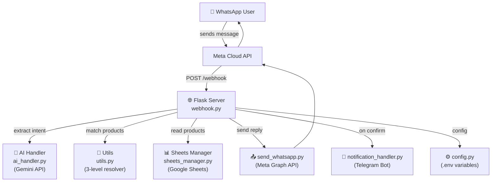
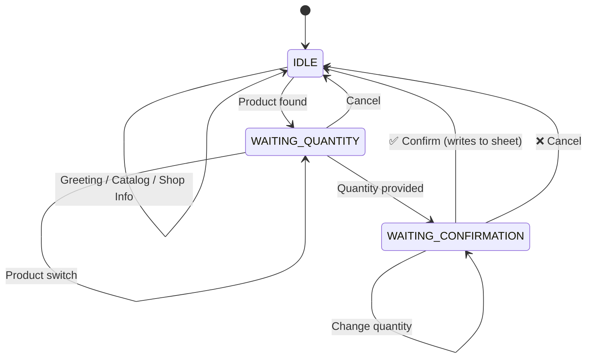
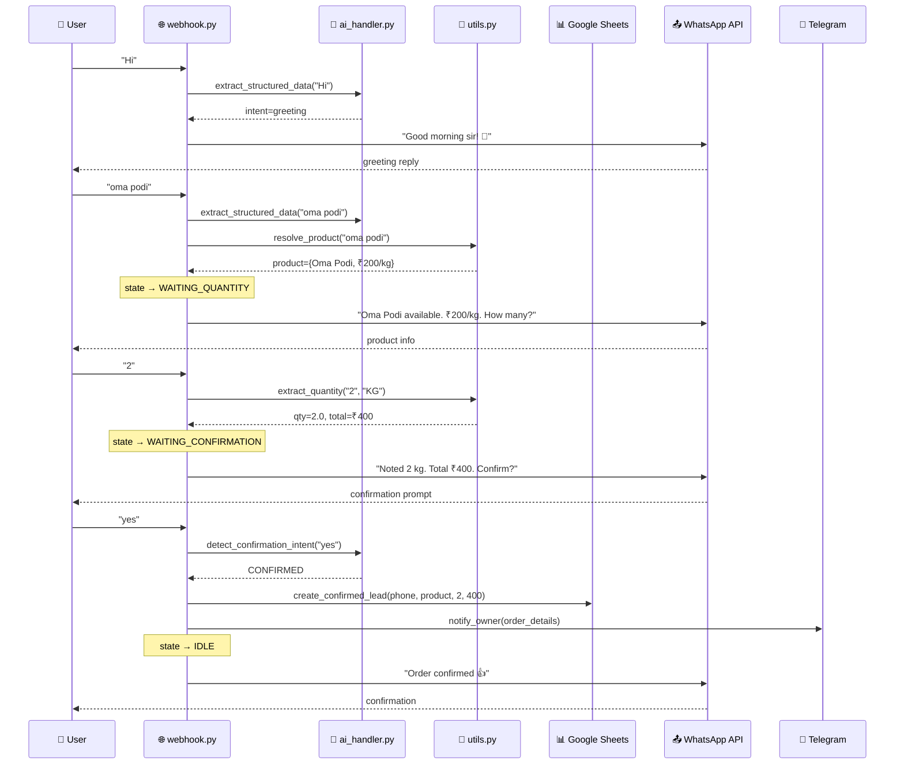

# 🗺️ AI Front Office Manager — Full Project Flow Map

## Architecture Overview

## Project Files

| File | Purpose |
|------|---------|
| [webhook.py](file:///d:/Ai-FrontOffice-Manager/webhook.py) | **Main server** — 3-state machine, routing, all message logic |
| [utils.py](file:///d:/Ai-FrontOffice-Manager/utils.py) | **Product resolver** (3-level: exact → boundary → fuzzy) + quantity parser |
| [ai_handler.py](file:///d:/Ai-FrontOffice-Manager/ai_handler.py) | **Gemini AI** — extracts intent, language, product from messages |
| [sheets_manager.py](file:///d:/Ai-FrontOffice-Manager/sheets_manager.py) | **Google Sheets** — products (STOCK_MASTER), leads (LEADS_ACTIVE) |
| [send_whatsapp.py](file:///d:/Ai-FrontOffice-Manager/send_whatsapp.py) | **WhatsApp API** — sends reply messages via Meta Graph API |
| [notification_handler.py](file:///d:/Ai-FrontOffice-Manager/notification_handler.py) | **Telegram alerts** — notifies shop owner on order confirmation |
| [config.py](file:///d:/Ai-FrontOffice-Manager/config.py) | **Config** — loads `.env` variables (API keys, shop info) |

## 3-State Session Machine

---

## Full Test Case Flow: Complete Conversation

### 📬 Step 1: User sends "Hi"

**State:** `IDLE` → stays `IDLE`

| Step | Code Location | What Happens |
|------|--------------|--------------|
| 1 | [webhook.py:286-361](file:///d:/Ai-FrontOffice-Manager/webhook.py#L286-L361) | POST `/webhook` → parse WhatsApp payload → extract `text = "Hi"`, `phone` |
| 2 | [webhook.py:336-354](file:///d:/Ai-FrontOffice-Manager/webhook.py#L336-L354) | **Deduplication check** — skip if message ID already processed |
| 3 | [webhook.py:369-373](file:///d:/Ai-FrontOffice-Manager/webhook.py#L369-L373) | **Shop info check** — "Hi" has no shop keywords → skip |
| 4 | [webhook.py:376-380](file:///d:/Ai-FrontOffice-Manager/webhook.py#L376-L380) | **AI extraction** → calls [ai_handler.py:extract_structured_data()](file:///d:/Ai-FrontOffice-Manager/ai_handler.py#L318-L376) → Gemini returns `intent="greeting"`, `language="en"` |
| 5 | [webhook.py:126-145](file:///d:/Ai-FrontOffice-Manager/webhook.py#L126-L145) | **Language detection** → `detect_language("Hi", "en")` → returns `"en"` |
| 6 | [webhook.py:383-386](file:///d:/Ai-FrontOffice-Manager/webhook.py#L383-L386) | **Catalog check** — "Hi" doesn't match catalog keywords → skip |
| 7 | [webhook.py:393-395](file:///d:/Ai-FrontOffice-Manager/webhook.py#L393-L395) | **State=IDLE** → calls [is_greeting("Hi")](file:///d:/Ai-FrontOffice-Manager/webhook.py#L246-L255) → ✅ matches |
| 8 | [webhook.py:186-199](file:///d:/Ai-FrontOffice-Manager/webhook.py#L186-L199) | **handle_greeting("en")** → checks hour → "Good morning sir! 🙏 Welcome to Anjali Sweets..." |
| 9 | [webhook.py:586-587](file:///d:/Ai-FrontOffice-Manager/webhook.py#L586-L587) | **Send reply** → [send_whatsapp_message()](file:///d:/Ai-FrontOffice-Manager/send_whatsapp.py#L15-L52) → POST to Meta API |

> **Reply:** *"Good morning sir! 🙏 Welcome to Anjali Sweets. How can I help you today?"*

---

### 📬 Step 2: User sends "show menu" (Catalog Enquiry)

**State:** `IDLE` → stays `IDLE`

| Step | Code Location | What Happens |
|------|--------------|--------------|
| 1-3 | Same as above | Parse, dedup, shop info check (skip) |
| 4 | [webhook.py:376-380](file:///d:/Ai-FrontOffice-Manager/webhook.py#L376-L380) | AI extraction → `intent="catalog"` |
| 5 | [webhook.py:383-386](file:///d:/Ai-FrontOffice-Manager/webhook.py#L383-L386) | [is_catalog_intent("show menu", "catalog")](file:///d:/Ai-FrontOffice-Manager/webhook.py#L228-L243) → ✅ "show menu" is in catalog keywords |
| 6 | [webhook.py:384](file:///d:/Ai-FrontOffice-Manager/webhook.py#L384) | [handle_catalog("en", products)](file:///d:/Ai-FrontOffice-Manager/webhook.py#L202-L225) → groups products by unit type (KG/Piece/Box), formats list |
| 7 | [webhook.py:385](file:///d:/Ai-FrontOffice-Manager/webhook.py#L385) | Send reply with full product list |

> **Reply:** *"Here are our products: 📦 Per KG: • Oma Podi – ₹200 • Pudina Oma Podi – ₹240 • Mysore Pak – ₹400 ..."*

---

### 📬 Step 3: User sends "oma podi" (Product Enquiry)

**State:** `IDLE` → `WAITING_QUANTITY`

| Step | Code Location | What Happens |
|------|--------------|--------------|
| 1-6 | Same as above | Parse, dedup, shop check, AI extraction, language, catalog check (all skip) |
| 7 | [webhook.py:393](file:///d:/Ai-FrontOffice-Manager/webhook.py#L393) | **State=IDLE** → `is_greeting("oma podi")` → ❌ not a greeting |
| 8 | [webhook.py:398](file:///d:/Ai-FrontOffice-Manager/webhook.py#L398) | Calls [resolve_product("oma podi", products)](file:///d:/Ai-FrontOffice-Manager/utils.py#L221-L327) |
| 9 | [utils.py:249-254](file:///d:/Ai-FrontOffice-Manager/utils.py#L249-L254) | **Level 1 (Exact):** `"oma podi" == "Oma Podi"` → ✅ match → returns product |
| 10 | [webhook.py:418-419](file:///d:/Ai-FrontOffice-Manager/webhook.py#L418-L419) | **Store in session:** `session["product"] = {Oma Podi...}`, `session["state"] = "WAITING_QUANTITY"` |
| 11 | [webhook.py:421-427](file:///d:/Ai-FrontOffice-Manager/webhook.py#L421-L427) | Format reply using `product_found` template |

> **Reply:** *"Oma Podi is available. Price ₹200 per kg. How many kg would you like?"*

---

### 📬 Step 4: User sends "2" (Quantity)

**State:** `WAITING_QUANTITY` → `WAITING_CONFIRMATION`

| Step | Code Location | What Happens |
|------|--------------|--------------|
| 1-6 | Same as above | Parse, dedup, shop check, AI, language, catalog |
| 7 | [webhook.py:444](file:///d:/Ai-FrontOffice-Manager/webhook.py#L444) | **State=WAITING_QUANTITY** |
| 8 | [webhook.py:450](file:///d:/Ai-FrontOffice-Manager/webhook.py#L450) | `is_cancellation("2")` → ❌ |
| 9 | [webhook.py:455](file:///d:/Ai-FrontOffice-Manager/webhook.py#L455) | `ai_intent != "enquiry"` → go to else block |
| 10 | [webhook.py:500](file:///d:/Ai-FrontOffice-Manager/webhook.py#L500) | Calls [extract_quantity("2", "KG")](file:///d:/Ai-FrontOffice-Manager/utils.py#L144-L212) |
| 11 | [utils.py:171-172](file:///d:/Ai-FrontOffice-Manager/utils.py#L171-L172) | **Step 1 (pure digit):** `"2".isdigit()` → ✅ → returns `2.0` |
| 12 | [webhook.py:503-508](file:///d:/Ai-FrontOffice-Manager/webhook.py#L503-L508) | Calculate: `price=200`, `total = 200 × 2 = ₹400`. Store: `session["quantity"]=2`, `session["total"]=400`, `session["state"]="WAITING_CONFIRMATION"` |
| 13 | [webhook.py:510-516](file:///d:/Ai-FrontOffice-Manager/webhook.py#L510-L516) | Format reply using `quantity_confirm` template |

> **Reply:** *"Noted 2 kg. Total ₹400. Shall I confirm the order?"*

---

### 📬 Step 5a: User sends "cancel" (Cancel Order)

**State:** `WAITING_CONFIRMATION` → `IDLE`

| Step | Code Location | What Happens |
|------|--------------|--------------|
| 1-6 | Same as above | Parse, dedup, shop check, AI, language, catalog |
| 7 | [webhook.py:521](file:///d:/Ai-FrontOffice-Manager/webhook.py#L521) | **State=WAITING_CONFIRMATION** |
| 8 | [webhook.py:526](file:///d:/Ai-FrontOffice-Manager/webhook.py#L526) | `is_confirmation("cancel")` → ❌ |
| 9 | [webhook.py:550](file:///d:/Ai-FrontOffice-Manager/webhook.py#L550) | [is_cancellation("cancel", ai_intent)](file:///d:/Ai-FrontOffice-Manager/webhook.py#L266-L273) → ✅ `"cancel" in "cancel"` |
| 10 | [webhook.py:551](file:///d:/Ai-FrontOffice-Manager/webhook.py#L551) | [clear_session(phone)](file:///d:/Ai-FrontOffice-Manager/webhook.py#L163-L167) → deletes session → back to `IDLE` |
| 11 | [webhook.py:552](file:///d:/Ai-FrontOffice-Manager/webhook.py#L552) | Reply using `order_cancelled` template |

> **Reply:** *"Okay sir, I have cancelled that order. How else can I help you?"*

> ⚠️ **No data written to Google Sheets** — cancellation means nothing was saved.

---

### 📬 Step 5b: User sends "yes" (Confirm Order) — *alternative to cancel*

**State:** `WAITING_CONFIRMATION` → `IDLE`

| Step | Code Location | What Happens |
|------|--------------|--------------|
| 1-6 | Same as above | Parse, dedup, shop check, AI, language, catalog |
| 7 | [webhook.py:521-524](file:///d:/Ai-FrontOffice-Manager/webhook.py#L521-L524) | **State=WAITING_CONFIRMATION**, load `product`, `quantity`, `total` from session |
| 8 | [webhook.py:526](file:///d:/Ai-FrontOffice-Manager/webhook.py#L526) | [is_confirmation("yes", ai_intent)](file:///d:/Ai-FrontOffice-Manager/webhook.py#L258-L263) → calls [detect_confirmation_intent("yes")](file:///d:/Ai-FrontOffice-Manager/ai_handler.py#L401-L463) → ✅ returns `"CONFIRMED"` |
| 9 | [webhook.py:528](file:///d:/Ai-FrontOffice-Manager/webhook.py#L528) | **📊 WRITE TO SHEET** → [sheets.create_confirmed_lead(phone, product, 2.0, 400)](file:///d:/Ai-FrontOffice-Manager/sheets_manager.py#L476-L521) → writes complete order row to LEADS_ACTIVE |
| 10 | [webhook.py:531-540](file:///d:/Ai-FrontOffice-Manager/webhook.py#L531-L540) | **🔔 TELEGRAM NOTIFICATION** → [notify_owner(notification_data)](file:///d:/Ai-FrontOffice-Manager/notification_handler.py#L131-L152) → sends formatted message to shop owner's Telegram |
| 11 | [webhook.py:542](file:///d:/Ai-FrontOffice-Manager/webhook.py#L542) | Reply using `order_confirmed` template |
| 12 | [webhook.py:548](file:///d:/Ai-FrontOffice-Manager/webhook.py#L548) | [clear_session(phone)](file:///d:/Ai-FrontOffice-Manager/webhook.py#L163-L167) → back to `IDLE` |

> **Reply:** *"Order confirmed 👍 We will prepare it. Our team will inform you the preparation time shortly! 🙏"*

---

## Data Flow Summary

## Key Design Rules

1. **No early sheet writes** — Data is only written to Google Sheets on explicit confirmation (Step 5b, line 528)
2. **Session is in-memory** — All order data lives in `session_store` dict, not persisted
3. **AI is used sparingly** — Only for intent/language extraction, NOT for generating replies
4. **Replies are template-based** — All responses come from the `TEMPLATES` dict (English + Tamil)
5. **3-level product matching** — Exact → Word-boundary → Fuzzy (in [utils.py](file:///d:/Ai-FrontOffice-Manager/utils.py#L221-L327))
